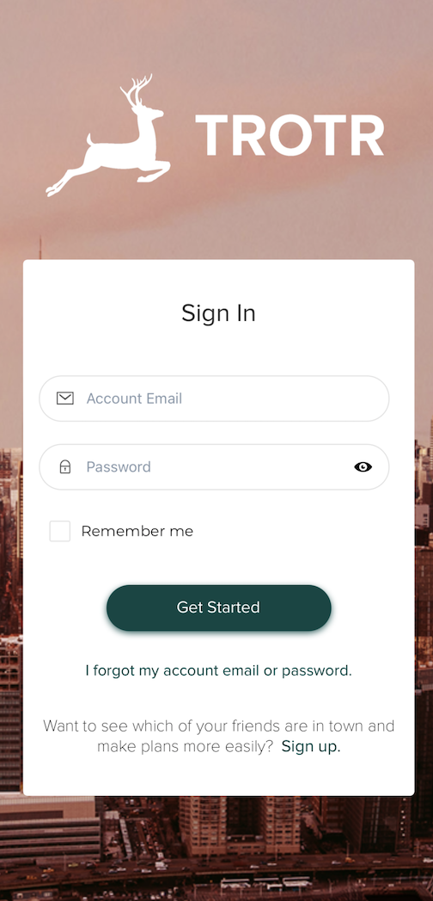
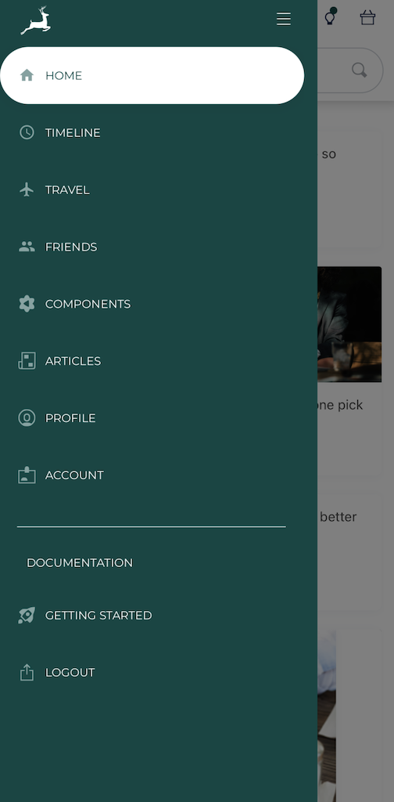

# [Trotr - Social Location Sharing](https://trotr-client.herokuapp.com/)

[comment]: <> ( ![version]&#40;https://img.shields.io/badge/version-1.9.0-blue.svg&#41;  [![GitHub issues open]&#40;https://img.shields.io/github/issues/creativetimofficial/ct-material-kit-pro-react.svg?maxAge=2592000&#41;]&#40;https://github.com/creativetimofficial/ct-material-kit-pro-react/issues?q=is%3Aopen+is%3Aissue&#41; [![GitHub issues closed]&#40;https://img.shields.io/github/issues-closed-raw/creativetimofficial/ct-material-kit-pro-react.svg?maxAge=2592000&#41;]&#40;https://github.com/creativetimofficial/ct-material-kit-pro-react/issues?q=is%3Aissue+is%3Aclosed&#41; [![Join the chat at https://gitter.im/NIT-dgp/General]&#40;https://badges.gitter.im/NIT-dgp/General.svg&#41;]&#40;https://gitter.im/creative-tim-general/Lobby&#41; [![Chat]&#40;https://img.shields.io/badge/chat-on%20discord-7289da.svg&#41;]&#40;https://discord.gg/E4aHAQy&#41;)

**[Trotr](https://expo.dev/@cubbythekid/trotr)** is a social location-sharing web app.

Its feature-set includes conventional social media MVC patterns (individual user accounts, protected views, shared status updates, etc.). Geo-location data is encoded via a Google Maps API and core functionality utilizes MongoDB's geo-querying features. Interactions and layout designs aim at simplifying the experience of connecting with people in person in various contexts (travelling, moving, or just day-to-day).

Trotr was built with Creative Tim's Material React Pro Kit -- a framework that uses JSS-styled Material-UI components.

## Table of Contents

* [Technologies](#technologies)
* [Quick Start](#quick-start)
* [Project Planning](#project-planning)
* [Browser Support](#browser-support)
* [Licensing](#licensing)

## Technologies

- [JSS](https://cssinjs.org/?v=v10.6.0)
- [React](https://demos.creative-tim.com/material-kit-pro-react/#/components#buttons)
- [React Native]()
- [Expo]()
- [Node](https://demos.creative-tim.com/material-kit-pro-react/#/components#navigation)
- [Express](https://demos.creative-tim.com/material-kit-pro-react/#/components#notifications)
- [MongoDB](https://demos.creative-tim.com/material-kit-pro-react/#/profile-page)
- [Mongoose](https://demos.creative-tim.com/material-kit-pro-react/#/landing-page)
- [JSON Web Token]()
- [Google Maps API](https://developers.google.com/maps)
- [Galio]()
- [Heroku](https://heroku.com)

## Quick start

- Visit the [Trotr](https://expo.dev/@cubbythekid/trotr) Expo site to see a demo of the mobile app!

## Project Planning

## Browser Support

Recommended browsers for using this app:

 

## Licensing

- Copyright 2021 Cubby Alexander
